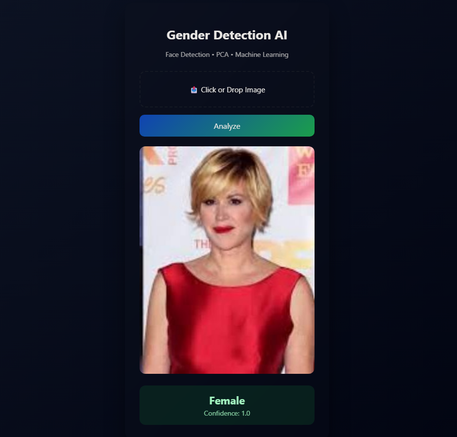

# Gender Classification App Using Machine Learning

This is a **Gender Classification Web Application** built using Python, Flask, OpenCV, PCA (Eigenfaces), and SVM.  
It detects a face in an uploaded image and predicts the gender as **Male** or **Female** with a confidence score.

---



## 🔹 Features

- Face detection using **Haar Cascades** (OpenCV)
- Gender classification using **PCA + SVM**
- Pre-trained model for fast predictions
- Clean, responsive **Flask UI** with image preview
- Handles single face images only
- Shows **prediction confidence** and error messages

---

## 🛠️ How It Works

1. **Face Detection**
   - Uses OpenCV’s `haarcascade_frontalface_default.xml`.
   - Skips images with **no faces** or **multiple faces**.

2. **Image Preprocessing**
   - Converts to grayscale
   - Resizes to `100x100`
   - Normalizes pixel values to `[0,1]`
   - Flattens the image into a vector
   - Centers by subtracting the training **mean face**

3. **Dimensionality Reduction**
   - Uses **PCA (Principal Component Analysis)** to reduce image vectors to 100 components (Eigenfaces).

4. **Gender Classification**
   - Trained **SVM (Support Vector Machine)** classifier with RBF kernel
   - Outputs probability/confidence of prediction

---

## 📦 Model Training

### 1. Load & Preprocess Images

- Images collected separately for **male** and **female**.
- Resized to `100x100` and normalized.
- Flattened into 1D vectors for PCA.

```python
male_X, male_y = load_images(male_folder, 0)
female_X, female_y = load_images(female_folder, 1)
X = np.array(male_X + female_X)
y = np.array(male_y + female_y)
````

### 2. Train/Test Split

* 80% training, 20% testing
* Stratified split to maintain class balance

```python
X_train, X_test, y_train, y_test = train_test_split(
    X, y, test_size=0.2, stratify=y, random_state=42
)
```

### 3. Center Data & Apply PCA

* Compute **mean face** from training data
* Transform images into PCA space (100 components)

```python
mean_face = X_train.mean(axis=0)
X_train_c = X_train - mean_face
X_test_c  = X_test  - mean_face
pca = PCA(n_components=100, whiten=True, svd_solver="randomized", random_state=42)
X_train_pca = pca.fit_transform(X_train_c)
X_test_pca  = pca.transform(X_test_c)
```

### 4. Train SVM Classifier

* RBF kernel, C=100, gamma=0.01 (tuned with GridSearchCV)
* Outputs probabilities for confidence scores

```python
model = SVC(C=100, kernel="rbf", gamma=0.01, probability=True)
model.fit(X_train_pca, y_train)
```

---

## 📊 Model Evaluation

* **Accuracy:** 98%
* **Precision & Recall:** Balanced for both classes
* **Confusion Matrix:**

```
[[350  12]
 [  4 396]]
```

* **AUC (ROC Curve):** 0.997

* **Precision-Recall Curve** plotted for analysis

* Hyperparameter tuning with **GridSearchCV** confirmed optimal parameters:

```text
Best parameters: {'C': 100, 'gamma': 0.01, 'kernel': 'rbf'}
Best cross-validation accuracy: 0.984
```

---

## 💾 Saving the Model

* The trained pipeline is saved as a **pickle bundle**:

```python
bundle = {
    "mean_face": mean_face,
    "pca": pca,
    "svm": best_model,
    "img_size": IMG_SIZE
}
with open("gender_face_model_tuned2.pkl", "wb") as f:
    pickle.dump(bundle, f)
```

* This bundle includes:

  * `mean_face` → Training mean for centering new images
  * `pca` → PCA object for dimensionality reduction
  * `svm` → Trained SVM model
  * `img_size` → Image size used for preprocessing

---

## 🚀 Running the Flask App

1. Clone the repository:

```bash
git clone https://github.com/muzi5622/gender-classification-app-using-ml.git
cd gender-classification-app-using-ml
```

2. Install dependencies:

```bash
pip install -r requirements.txt
```

3. Run the Flask app:

```bash
python app.py
```

4. Open in browser:

```
http://127.0.0.1:5000
```

* Upload an image
* See predicted gender and confidence

---

## 🖼️ UI Features

* Drag & drop file upload
* Image preview
* Prediction badge with confidence
* Responsive, modern design
* Handles errors like no face or multiple faces

---

## ⚙️ Notes

* Only **single face images** are supported
* Works for JPG/PNG images
* For production, consider **removing model file from repo** and using cloud storage for large files (>100MB)

---

---

## 🔗 References

* OpenCV Haar Cascades: [https://docs.opencv.org/](https://docs.opencv.org/)
* PCA for Face Recognition: Turk & Pentland (1991)
* SVM Classifier: scikit-learn documentation

